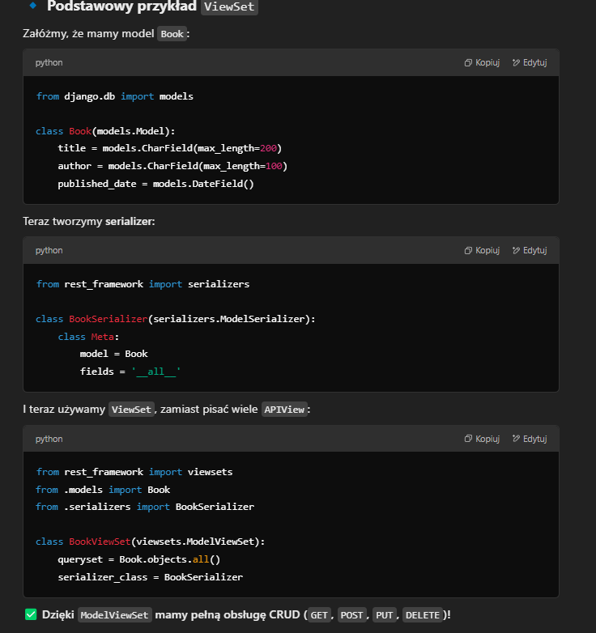
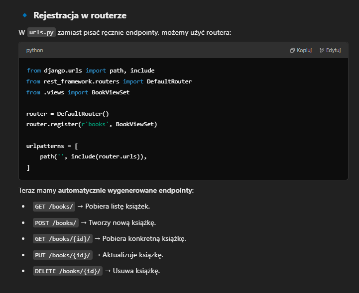

# Co to jest ViewSet w Django?
W Django REST framework (DRF), ViewSet to specjalna klasa, która łączy logikę CRUD w jednym miejscu, 
eliminując konieczność pisania osobnych APIView dla różnych operacji.

W skrócie:

ViewSet to zestaw widoków dla określonego modelu/danych.
Automatycznie obsługuje metody HTTP (GET, POST, PUT, DELETE).
Współpracuje z routerami (routers.DefaultRouter), co upraszcza zarządzanie URL-ami.

