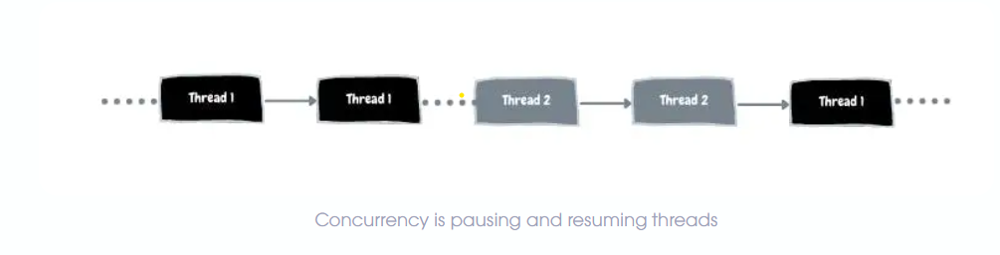
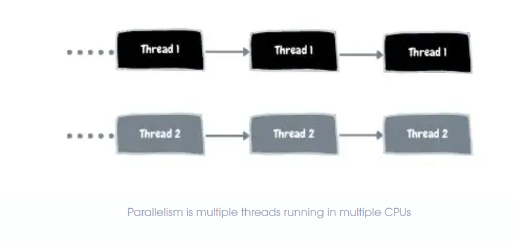

**What is concurrency?**
To understand the difference between concurrency vs parallelism, let’s begin with a definition of concurrency. 
According to the Oxford Dictionary, concurrency means two or more things happening at the same time. 
However, this definition isn’t very helpful because parallel execution would also mean something similar. 
Let’s take a closer look at multitasking definition first. 

A Central Processing Unit (CPU, or simply a processor) can work on only one task at a time. 
If multiple tasks are given to it, e.g., playing a song and writing code, it simply switches between these tasks. 
This switching is so fast and seamless that, for a user, it feels like multitasking.

This capability of modern CPUs to pause and resume tasks so fast gives an illusion as if the tasks are running in parallel. 
However, this is not parallel. This is concurrent.

**What is parallelism?**
In the previous section, we looked at a single processor. However, most processors have more than one core. 
In some cases, a machine can have more than one processor.

One example is parallel computing. This is a type of computation in which multiple processors carry out many processes at the same time. 
To achieve this parallel processing, specialized programming is needed. 
This is known as parallel programming, where the code is written to utilize multiple CPU Cores. 
In this case, more than one process is actually executed in parallel. The following image should help understand parallelism.

