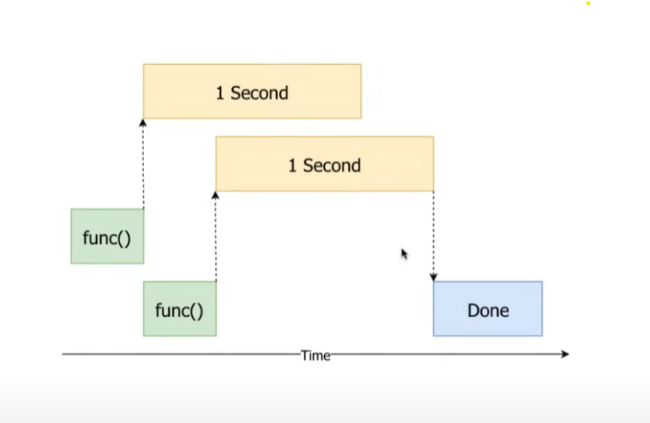

Wybór między Celery a asyncio zależy od konkretnych wymagań i charakterystyki projektu, w tym od rodzaju zadań, architektury aplikacji, skalowalności, wydajności, a także preferencji i doświadczenia zespołu deweloperskiego. Oto kilka czynników, które warto rozważyć przy podejmowaniu decyzji:

Celery
Zadania asynchroniczne i harmonogramowanie: Celery jest silnym narzędziem do obsługi asynchronicznych zadań i harmonogramowania zadań w tle. Jest to szczególnie przydatne w przypadku zadań, które wymagają przetwarzania w tle, takich jak wysyłanie e-maili, generowanie raportów, integracje z usługami zewnętrznymi itp.

Wsparcie dla kolejek zadań: Celery oferuje elastyczne mechanizmy kolejek, które pozwalają na dystrybucję zadań do wielu pracowników (workers) oraz kontrolę nad priorytetami i kolejkami zadań.

Łatwość konfiguracji: Celery ma bogatą dokumentację i obszerną społeczność, co ułatwia jego konfigurację i rozpoczęcie pracy z tym narzędziem. Posiada również wiele wbudowanych mechanizmów kontroli błędów, monitoringu oraz skalowania.

asyncio
Programowanie asynchroniczne w Pythonie: asyncio to biblioteka standardowa Pythona, która umożliwia programowanie asynchroniczne, pozwalając na równoległe wykonywanie wielu zadań I/O-zorientowanych bez blokowania wątków. Jest przydatne w aplikacjach, które muszą obsługiwać wiele równoległych operacji wejścia/wyjścia, takich jak serwisy sieciowe, API, serwisy internetowe itp.

Wydajność dla zadań I/O-zorientowanych: asyncio może być szczególnie skuteczne w obsłudze zadań, które są zdominowane przez operacje wejścia/wyjścia, ponieważ umożliwia asynchroniczne wykonanie wielu takich operacji w jednym wątku.

Prostota i minimalizm: asyncio oferuje prostszy i bardziej minimalistyczny model programowania niż Celery, co może być korzystne w przypadku prostszych projektów lub tych, które nie wymagają pełnego systemu zarządzania zadaniami w tle.

Podsumowanie
Celery: Bardziej odpowiedni dla złożonych aplikacji wymagających zarządzania zadaniami w tle, harmonogramowaniem, monitorowaniem i skalowaniem.
asyncio: Lepszy wybór dla aplikacji opartych na operacjach I/O, gdzie wydajność i równoległe wykonywanie wielu operacji są kluczowe, a zarządzanie zadaniami w tle nie jest głównym wymaganiem.
W niektórych przypadkach można również wykorzystać oba podejścia równocześnie, np. używając asyncio w warstwie serwerowej do obsługi wielu żądań I/O-zorientowanych, a Celery do obsługi zadań asynchronicznych i zadań tła. Ostateczny wybór zależy od specyfiki projektu oraz preferencji deweloperów i zespołu.

CPU bound tasks to takie które używają procesora, liczą coś, wykorzystują moc obliczeniową. - lepsze celery/multiprocessing
I/O bound tasks to takie które czekają na input/output i nie wykorzystują w tym czasie procesora. - lepsze asyncio/threading
np. czytanie/pisanie do pliku, albo operacje sieciowe/requesty

Wykorzystanie thredingu do zadań które wmagają dużej mocy obliczeniowej może wpłynąć negatywnie na czas wykonania.
asyncio is essentially threading where not the CPU but you, as a programmer (or actually your application), 
decide where and when does the context switch happen. In Python you use an await keyword to suspend the execution of your coroutine (defined using async keyword).

Threading:



Threading w pythonie tak na prawdę nie jest prawdziwym threadingiem.
Taski nie zaczynają się wykonywać jednocześnie, tylko po chwili gdy zadanie I/O zablokuje wątek, to GIL oblokowuje kolejny. 


```
if io_bound:
    if io_very_slow:
        print("Use Asyncio")
    else:
        print("Use Threads")
else:
    print("Multi Processing")
```