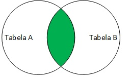
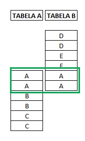
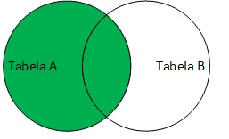
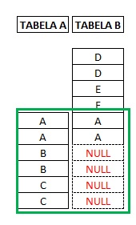
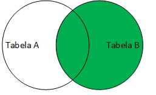
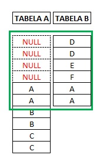
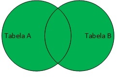
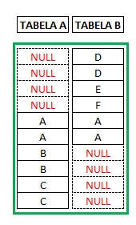
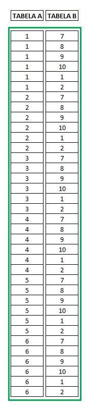

W kontekście baz danych, operacja JOIN pozwala na łączenie wierszy z dwóch lub więcej tabel na podstawie wspólnej kolumny (klucza). 
Jest to podstawowa operacja w relacyjnych bazach danych, która umożliwia efektywne tworzenie zapytań korzystających z danych rozproszonych po wielu tabelach. 
Oto podstawowe rodzaje JOINów:
1. INNER JOIN
Co robi: Zwraca wiersze, dla których istnieje dopasowanie w obu łączonych tabelach.
Użycie: Używany, gdy chcesz uzyskać tylko te rekordy, które mają odpowiadające sobie wartości w obu tabelach.
 
2. LEFT OUTER JOIN (LEFT JOIN)
Co robi: Zwraca wszystkie wiersze z lewej tabeli i dopasowane wiersze z prawej tabeli. Dla wierszy z lewej tabeli, które nie mają dopasowania w prawej tabeli, 
wynikiem będzie NULL w kolumnach prawej tabeli.
Użycie: Używany, gdy chcesz uzyskać wszystkie rekordy z lewej tabeli niezależnie od tego, czy mają one odpowiadające sobie wartości w prawej tabeli.
 
3. RIGHT OUTER JOIN (RIGHT JOIN)
Co robi: Zwraca wszystkie wiersze z prawej tabeli i dopasowane wiersze z lewej tabeli. Dla wierszy z prawej tabeli, które nie mają dopasowania w lewej tabeli, wynikiem będzie NULL w kolumnach lewej tabeli.
Użycie: Używany, gdy chcesz uzyskać wszystkie rekordy z prawej tabeli niezależnie od tego, czy mają one odpowiadające sobie wartości w lewej tabeli.
 
4. FULL OUTER JOIN (FULL JOIN)
Co robi: Zwraca wiersze, gdy istnieje dopasowanie w jednej z tabel. Dla wierszy, które nie mają dopasowania w drugiej tabeli, wynikiem będzie NULL w kolumnach tej drugiej tabeli.
Użycie: Używany, gdy chcesz uzyskać wszystkie rekordy z obu tabel, niezależnie od tego, czy mają one odpowiadające sobie wartości.
 
5. CROSS JOIN
Co robi: Zwraca iloczyn kartezjański dwóch tabel, tj. do każdego wiersza z pierwszej tabeli dopasowuje każdy wiersz z drugiej tabeli.
Użycie: Rzadziej używany, może być przydatny, gdy potrzebujemy wygenerować wszystkie możliwe kombinacje wierszy między dwiema tabelami.

Każdy z tych JOINów może być użyty w różnych sytuacjach w zależności od potrzeb zapytania i struktury danych. Wybór odpowiedniego JOINa ma kluczowe znaczenie dla efektywności zapytań i ich wyników.