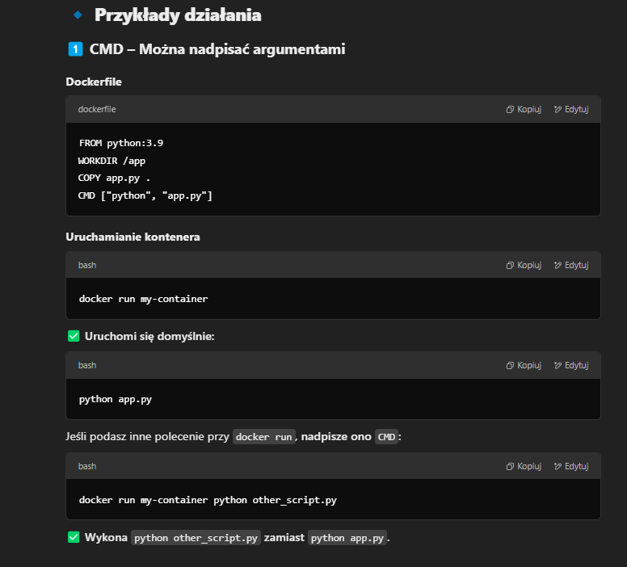
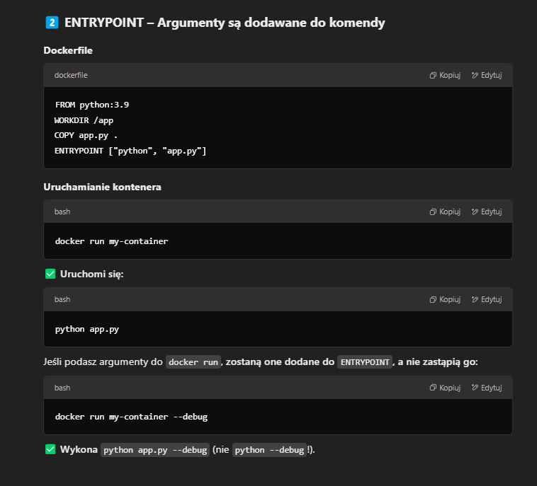
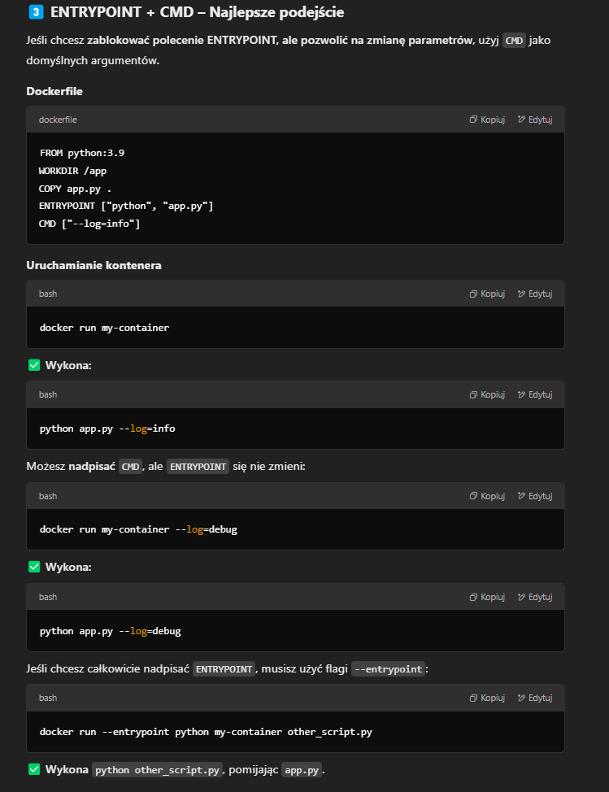

# Czym sie różni CMD od entrypoint w dockerfile?

W Dockerze zarówno CMD jak i ENTRYPOINT służą do określenia domyślnej komendy uruchamianej w kontenerze. 
Mają jednak kluczowe różnice w działaniu i zastosowaniu.

